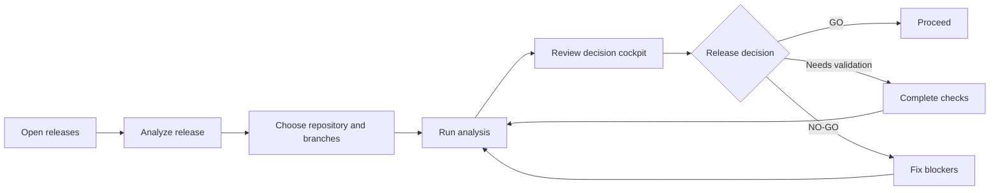
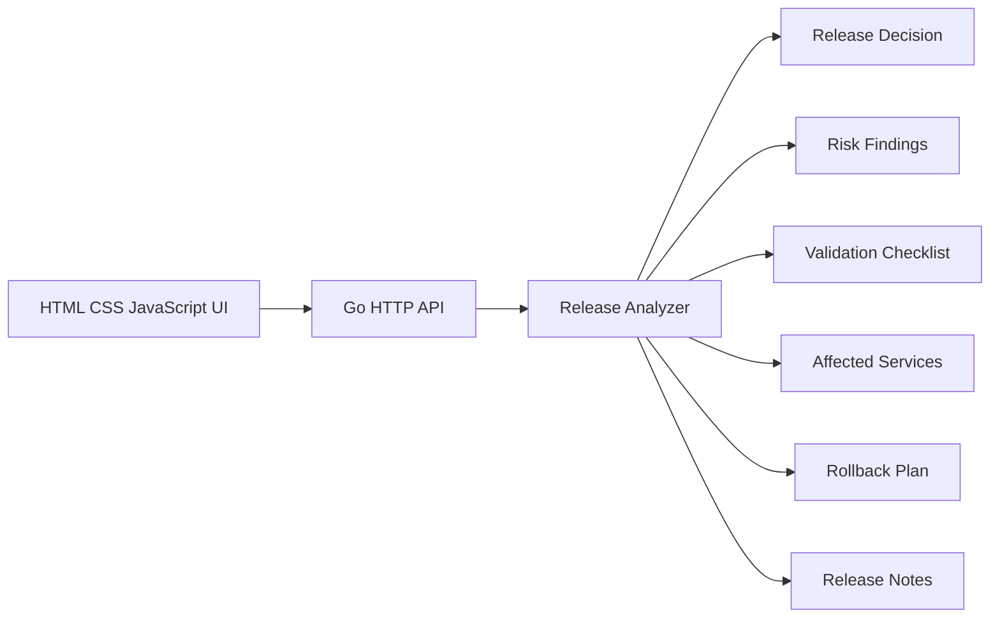

# ReleasePilot

ReleasePilot is an AI-assisted release readiness dashboard for monoliths and
microservice repositories. It helps engineering teams answer one important
question:

> Is this release safe, and what evidence supports that decision?

This repository contains the first ReleasePilot MVP: a compact decision
cockpit backed by a Go API and a dependency-free HTML, CSS, and JavaScript
frontend.

## MVP Scope

The MVP analyzes one release candidate and presents:

- A `GO`, `NEEDS VALIDATION`, or `NO-GO` recommendation
- A release health score and risk breakdown
- Required validation checks
- Evidence-backed risk findings
- Affected services and blast radius
- A rollback plan
- Generated release notes

The initial analyzer uses deterministic sample analysis so the complete
product workflow can be tested before repository scanners and AI agents are
connected.

## User Workflow



## Architecture



## Project Structure

```text
.
├── README.md
├── go.mod
├── main.go
├── main_test.go
└── web
    ├── app.js
    ├── index.html
    └── styles.css
```

## API

### `GET /api/health`

Returns the service health status.

### `GET /api/releases`

Returns the known release candidates.

### `GET /api/releases/{id}`

Returns the complete release readiness report for one release.

### `POST /api/analyze`

Creates a release analysis.

Example request:

```json
{
  "repository": "acme/payment-platform",
  "baseBranch": "main",
  "releaseBranch": "release/v2.14.0"
}
```

## Run Locally

Requirements:

- Go 1.22 or newer

Start ReleasePilot:

```bash
go run .
```

Open:

```text
http://localhost:8080
```

Run tests:

```bash
go test ./...
```

## Current Limitations

- Analysis results are generated from deterministic MVP rules.
- Repository providers and CI/CD systems are not connected yet.
- Release approvals and deployment execution are intentionally excluded.
- Data is held in memory and resets when the server restarts.

## Next Milestones

1. Parse real Git diffs and repository metadata.
2. Detect service boundaries, dependencies, and owners.
3. Add specialized AI analysis agents.
4. Connect GitHub pull requests and CI results.
5. Add policy-driven release gates and audit history.
