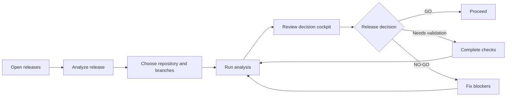
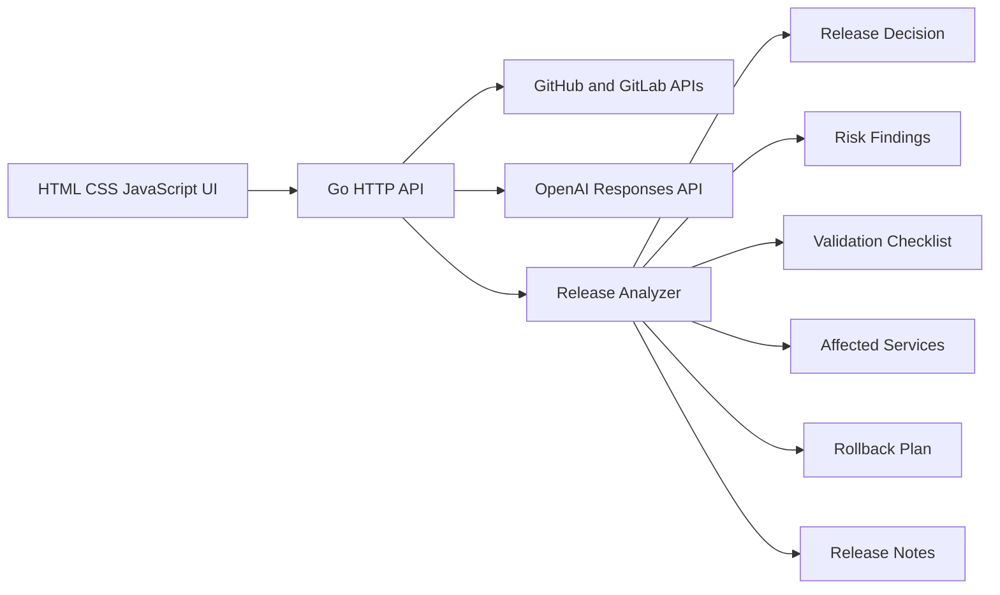

# ReleasePilot

ReleasePilot is an AI-assisted release readiness dashboard for monoliths and
microservice repositories. It helps engineering teams answer one important
question:

> Is this release safe, and what evidence supports that decision?

ReleasePilot is a compact decision cockpit backed by a Go API and a
dependency-free HTML, CSS, and JavaScript frontend.

## MVP Scope

The MVP analyzes one release candidate and presents:

- A `GO`, `NEEDS VALIDATION`, or `NO-GO` recommendation
- A release health score and risk breakdown
- Required validation checks
- Evidence-backed risk findings
- Affected services and blast radius
- A rollback plan
- Generated release notes

ReleasePilot can fetch real repository history from GitHub and GitLab, then
use OpenAI to generate an evidence-backed release report. A deterministic
analyzer remains available as a demo and fallback.

## User Workflow



## Architecture



## Project Structure

```text
.
├── README.md
├── go.mod
├── main.go
├── main_test.go
└── web
    ├── app.js
    ├── index.html
    └── styles.css
```

## API

### `GET /api/health`

Returns the service health status.

### `GET /api/releases`

Returns the known release candidates.

### `GET /api/releases/{id}`

Returns the complete release readiness report for one release.

### `POST /api/analyze`

Creates a release analysis.

Example request:

```json
{
  "provider": "github",
  "repository": "acme/payment-platform",
  "baseBranch": "main",
  "releaseBranch": "release/v2.14.0"
}
```

### `GET /api/settings`

Returns safe configuration status. Stored access tokens and API keys are never
included in responses.

### `PUT /api/settings`

Stores GitHub, GitLab, and OpenAI credentials in server memory. Blank secret
fields preserve the currently configured secret.

### `GET /api/repositories?provider=github`

Returns repositories visible to the configured read-only provider token.

### `GET /api/history?provider=github&repository=owner/repo&ref=main`

Returns recent commit history for a repository ref.

### `GET /api/releases/{id}/pdf`

Downloads the release readiness report as a PDF.

## Run Locally

Requirements:

- Go 1.22 or newer

Start ReleasePilot:

```bash
OPENAI_API_KEY=your-key go run .
```

Open:

```text
http://localhost:8080
```

Run tests:

```bash
go test ./...
```

## Credential Security

- GitHub tokens should be fine-grained tokens with read-only repository
  `Contents` and `Metadata` permissions.
- GitLab tokens should use the `read_api` scope only.
- Provider tokens and OpenAI keys are write-only in the UI and never returned
  by the API.
- Credentials entered in Settings are held in server memory and reset when the
  server restarts.
- For production deployment, replace in-memory secret storage with a managed
  secret store.

## Current Limitations

- Repository analysis currently uses commit history, not complete Git diffs.
- CI/CD and runtime systems are not connected yet.
- Release approvals and deployment execution are intentionally excluded.
- Data is held in memory and resets when the server restarts.

## Next Milestones

1. Parse compare diffs and repository metadata.
2. Detect service boundaries, dependencies, and owners.
3. Add specialized AI analysis agents.
4. Connect GitHub pull requests and CI results.
5. Add policy-driven release gates and audit history.
